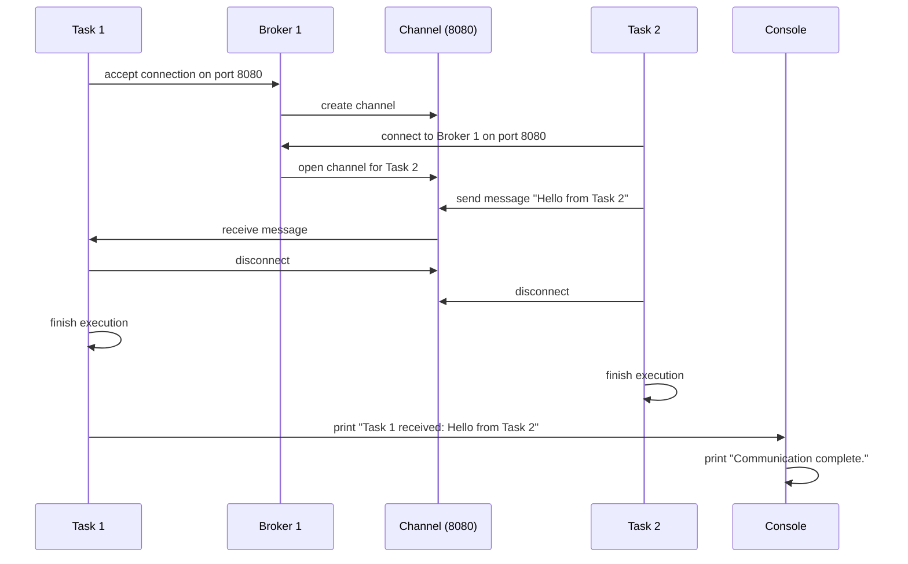
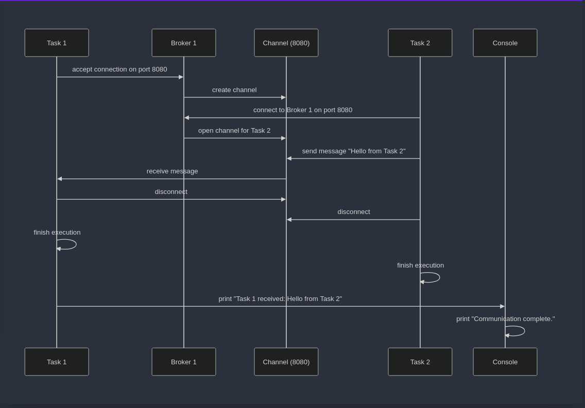

# Spécification

Ci-dessous la spécification de l'API de communication entre différentes tâches. Utile pour établir des caneaux de communication entre des tâches et permettre l'échange de données en `byte[]` entre elles.

## Structure de la spécification

1. [Idée générale](#idée-générale)
2. [Classes abstraites](#classes-abstraites)
	1. [Broker](#broker)
	2. [Channel](#channel)
	3. [Task](#task)
3. [Exemple d'utilisation](#exemple-dutilisation)


## Idée générale

Le but de ce projet est de créer une API de communication entre des  `Tâches` qui communiquent via des `Brokers` et des `Channels`.

Le `broker` qui est attaché à une ou plusieurs `tâches` peut demander ou accepter des connexions, créant alors un `canal de communication`. Une `tâche` peut lire et écrire des données sur le broker. Ces données sont envoyées via un `Channel` qui est créé par le `broker` lorsqu'une connexion est acceptée. C'est le `Channel` qui une fois créé permet de lire et écrire des données en `byte[]`.

## Classes abstraites

La spécification est composée de trois classes abstraites : `Broker`, `Channel` et `Task`. 

### Broker

```java
abstract class Broker {
	Broker(String name);
	Channel accept(int port);
	Channel connect(String name, int port);
}
```

`Broker` est une classe abstraite qui permet de créer des canaux de communication. Il est possible de créer un `Channel` en acceptant une connexion entrante via la méthode `accept` ou en se connectant à un broker distant via la méthode `connect`.


#### Méthodes
- **Broker (String name)**
Constructeur de la classe `Broker`. Le paramètre `name` est le nom du broker, il est unique pour chaque broker.
- **Channel accept(int port)**
Méthode permettant d'accepter une connexion entrante sur le port `port`. Retourne un objet de type `Channel`.
- **Channel connect(String name, int port)**
Méthode permettant de se connecter à un serveur distant. Le paramètre `name` est le nom du serveur distant et `port` est le port du serveur distant. Retourne un objet de type `Channel`.

### Channel
```java
abstract class Channel {
	int read(byte[] bytes, int offset, int length);
	int write(byte[] bytes, int offset, int length);
	void disconnect();
	boolean disconnected();
}
```

Le `Channel` est une classe abstraite qui permet de lire et d'écrire des données sur le serveur. Il est possible de lire des données via la méthode `read`, d'écrire des données via la méthode `write`, de se déconnecter du serveur via la méthode `disconnect` et de vérifier si la connexion est fermée via la méthode `disconnected`. Ce channel sera manipulé par les tâches et le broker pour échanger des données.

Le channel ne perds pas les données qui lui sont envoyées, il les stocke dans une file d'attente. Les données sont lues dans l'ordre dans lequel elles ont été écrites. Il est donc `FIFO LOSSLESS`. Ici le channel est `bi-directionnel full-duplex`, c'est-à-dire que les deux parties peuvent écrire et lire en même temps, on aura donc 2 canaux de communication entre les deux parties. Le type de données est 'byte[]', avec `TCP` comme protocole de transport, on transmet donc un flux d'octets.

Le channel n'est pas multi-threadé, il est donc possible d'avoir des problèmes de concurrence si plusieurs tâches essaient de lire ou d'écrire en même temps. Le channel peut appartenir à plusieurs tâches il est donc nécessaire de synchroniser les accès au channel si plusieurs tâches y accèdent en même temps, `cela ne sera pas géré par le channel lui-même`. 

#### Exemple de problème de concurrence

T1 veut envoyer 5, T2 veux envoyer 3. T3 et T4 attendent 5 et 3 respectivement. T1 envoie 2 et lache le verrou, T2 prend le verrou et envoie 3. T3 prends le verrou et reçoit un message mélangé. T4 prends le verrou et reçoit un message mélangé.

#### Méthodes
- **int read(byte[] bytes, int offset, int length)**
Méthode `bloquante` permettant de lire des données du serveur. Les données lues sont stockées dans le tableau `bytes` à partir de l'indice `offset` et pour une longueur de `length`. Retourne le nombre d'octets lus, ou -1 si une erreur survient.
- **int write(byte[] bytes, int offset, int length)**
Méthode `bloquante` permettant d'écrire des données sur le serveur. Les données à écrire sont stockées dans le tableau `bytes` à partir de l'indice `offset` et pour une longueur de `length`. Retourne le nombre d'octets écrits ou -1 si une erreur survient.
- **void disconnect()**
Méthode permettant de se déconnecter du serveur.
- **boolean disconnected()**
Méthode permettant à un server ou client de vérifier si la connexion est fermée.

### Task
```java
abstract class Task extends Thread {
	Task(Broker b, Runnable r);
	static Broker getBroker();
}
```

Une `Task` est une classe abstraite qui représente les clients qu'on essaie de relier entre eux. Elle est une extension de la classe `Thread` de Java. Il est possible de récupérer le `Broker` associé à la `Task` via la méthode `getBroker`.

La tâche peut se connecter à un serveur distant via le broker associé, dans ce cas on s'attend à ce qu'une autre tâche effectue un `accept` sur le port du broker. La tâche peut également accepter une connexion entrante via le broker associé, dans ce cas on s'attend à ce qu'une autre tâche effectue un `connect` sur le nom du broker.

#### Méthodes
- **Task(Broker b, Runnable r)**
Constructeur de la classe `Task`. Le paramètre `b` est le broker associé à la tâche et `r` est le runnable associé à la tâche. Un broker peut être associé à plusieurs tâches, mais une tâche ne peut être associée qu'à un seul broker.
- **static Broker getBroker()**
Méthode permettant de récupérer le `broker` associé à la tâche.

## Exemple d'utilisation

La classe suivante se situe dans le package `test` et est nommée `example` :

```java
public class example
```

Cette classe met en place un test simple de communication entre deux tâches via un broker et des canaux. 
- Un brokers est créé : `broker1`.
- Task 1 (associée à `broker1`) attend une connexion sur le port 8080 et lit les données reçues via un canal.
-  Task 2 (associée à `broker1`) se connecte à `broker1` via le port 8080, envoie un message, puis se déconnecte.
- Les deux tâches sont exécutées simultanément et une fois la communication terminée, un message indique la fin.
 
Ce test illustre l'utilisation de l'API pour établir une communication bidirectionnelle entre tâches.



