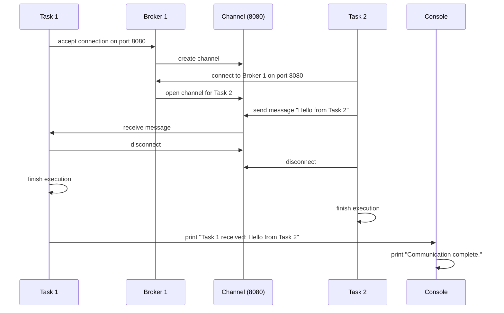
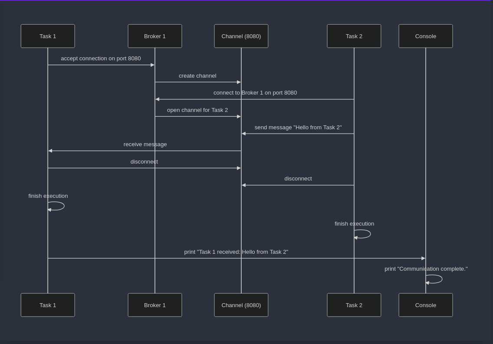

# Spécification

Spécification d'une API pour la communication `Inter-tâches` basée sur des `Brokers` et des `Canaux`.

## Structure de la spécification

1. [Idée générale](#idée-générale)
2. [Classes abstraites](#classes-abstraites)
	1. [Broker](#broker)
	2. [Channel](#channel)
	3. [Task](#task)
3. [Exemple d'utilisation](#exemple-dutilisation)


## Idée générale

Le but de cette spécification est de définir une API permettant l'échange de données sous forme de tableaux d'octets (byte[]) entre des tâches communicant via des Brokers et des Channels.

Un Broker est un composant qui gère la communication entre plusieurs tâches. Il permet de créer des Channels (canaux) qui véhiculent les données sous forme de tableaux d'octets (byte[]). Ces canaux sont établis en réponse à des connexions acceptées ou initiées par des tâches via le broker. Une `tâche` peut lire et écrire des données sur le broker. Ces données sont envoyées via un `Channel` qui est créé par le `broker` lorsqu'une connexion est acceptée. C'est le `Channel` qui une fois créé permet de lire et écrire des données en `byte[]`.

## Classes abstraites

La spécification est composée de trois classes abstraites : `Broker`, `Channel` et `Task`. 

### Broker

```java
abstract class Broker {
	Broker(String name);
	Channel accept(int port);
	Channel connect(String name, int port);
}
```

`Broker` est une classe abstraite qui permet de créer des canaux de communication. Il est possible de créer un `Channel` en acceptant une connexion entrante via la méthode `accept` ou en se connectant à un broker distant via la méthode `connect`.

#### Méthodes
- **Broker (String name)**
Constructeur de la classe `Broker`. Le paramètre `name` est le nom du broker, il est unique pour chaque broker.
- **Channel accept(int port)**
Méthode bloquante qui accepte une connexion entrante sur le `port` spécifié. 

<!-- Si plusieurs connexions sont tentées simultanément, elles sont placées dans une file d'attente FIFO. Un nouvel objet `Channel` est créé et renvoyé une fois la connexion acceptée. -->

<!-- Spécifier taille file, comportement si la file est pleine ... -->

- **Channel connect(String name, int port)**
Méthode permettant de se connecter à un broker distant via son `nom` et son `port`. Si la connexion échoue (ex. : nom incorrect, serveur non joignable), une exception appropriée est levée, indiquant la nature de l’erreur (par exemple `ConnectionException` ou `TimeoutException`).

### Channel
```java
abstract class Channel {
	int read(byte[] bytes, int offset, int length);
	int write(byte[] bytes, int offset, int length);
	void disconnect();
	boolean disconnected();
}
```

Le `Channel` est une classe abstraite qui permet de lire et d'écrire des données sur le serveur. Il est possible de lire des données via la méthode `read`, d'écrire des données via la méthode `write`, de se déconnecter du serveur via la méthode `disconnect` et de vérifier si la connexion est fermée via la méthode `disconnected`. Ce channel sera manipulé par les tâches et le broker pour échanger des données.

Le channel ne perds pas les données qui lui sont envoyées, il les stocke dans une file d'attente. Les données sont lues dans l'ordre dans lequel elles ont été écrites. Il est donc `FIFO LOSSLESS`. Ici le channel est `bi-directionnel full-duplex`, c'est-à-dire que les deux parties peuvent écrire et lire en même temps, on aura donc 2 canaux de communication entre les deux parties. Le type de données est 'byte[]', avec `TCP` comme protocole de transport, on transmet donc un flux d'octets.

Le Channel n'est pas `thread-safe`, ce qui signifie que des accès concurrents peuvent causer des violations de l'ordre FIFO. L'utilisateur doit explicitement synchroniser les accès au Channel, par exemple en utilisant des mécanismes comme les `synchronized blocks` ou `Locks`. Une mauvaise gestion des accès peut entraîner des corruptions de données et des lectures incohérentes.

Exemple de problème de concurrence :
- T1 veut envoyer 5, T2 veux envoyer 3. T3 et T4 attendent 5 et 3 respectivement. T1 envoie 2 et lache le verrou, T2 prend le verrou et envoie 3. T3 prends le verrou et reçoit un message mélangé. T4 prends le verrou et reçoit un message mélangé.

#### Méthodes
- **int read(byte[] bytes, int offset, int length)**
Méthode `non bloquante` permettant de lire des données actuelles du serveur. Les données lues sont stockées dans le tableau `bytes` à partir de l'indice `offset` et pour une longueur de `length`. Retourne le nombre d'octets lus (zéro inclu), ou -1 si une erreur survient.

<!-- TODO : Spécifier les erreurs possibles -->

- **int write(byte[] bytes, int offset, int length)**
Méthode `non bloquante` permettant d'écrire des données actuelles sur le serveur. Les données à écrire sont stockées dans le tableau `bytes` à partir de l'indice `offset` et pour une longueur de `length`. Retourne le nombre d'octets écrits (zéro inclu) ou -1 si une erreur survient.

<!-- TODO : Spécifier les erreurs possibles -->

- **void disconnect()**
La méthode assure que toutes les données en transit sont bien transmises avant la fermeture du canal. La déconnexion peut être non-bloquante pour la tâche appelante, mais les données restantes seront transmises avant la finalisation complète de la fermeture du canal, garantissant ainsi l’intégrité des échanges (`FIFO LOSSLESS`).
- **boolean disconnected()**
Méthode permettant à un server ou client de vérifier si la connexion est fermée.

### Task
```java
abstract class Task extends Thread {
	Task(Broker b, Runnable r);
	static Broker getBroker();
}
```

Une `Task` est une classe abstraite qui représente les clients qu'on essaie de relier entre eux. Elle est une extension de la classe `Thread` de Java. Il est possible de récupérer le `Broker` associé à la `Task` via la méthode `getBroker`.

La tâche peut se connecter à un serveur distant via le broker associé, dans ce cas on s'attend à ce qu'une autre tâche effectue un `accept` sur le port du broker. La tâche peut également accepter une connexion entrante via le broker associé, dans ce cas on s'attend à ce qu'une autre tâche effectue un `connect` sur le nom du broker.

#### Méthodes
- **Task(Broker b, Runnable r)**
Une instance de Task peut être exécutée dans un contexte multithreadé. Toutefois, chaque Task ne doit être associée qu'à un seul broker à un instant donné.
- **static Broker getBroker()**
Méthode permettant de récupérer le `broker` associé à la tâche, la tâche peut ensuite demander ou accepter des connexions via ce broker.

#### Runnable

Le paramètre `r` du constructeur de la classe `Task` est un objet de type `Runnable`. Il permet de définir le comportement de la tâche. La méthode `run` de l'objet `Runnable` est appelée lorsque la tâche est démarrée. Cette méthode s'exécute dans un nouveau thread.

## Exemple d'utilisation

La classe suivante se situe dans le package `test` et est nommée `example` :

```java
public class example
```

Cette classe met en place un test simple de communication entre deux tâches via un broker et des canaux. 
- Un brokers est créé : `broker1`.
- Task 1 (associée à `broker1`) attend une connexion sur le port 8080 et lit les données reçues via un canal.
- Task 2 (associée à `broker1`) se connecte à `broker1` via le port 8080, envoie un message, puis se déconnecte.
- Les deux tâches sont exécutées simultanément et une fois la communication terminée, un message indique la fin.
 
Il peut être étendu à des scénarios où plusieurs tâches utilisent le même `Broker`, ou où des `Brokers distincts` interagissent via des `Channels` multiples pour établir des systèmes distribués plus complexes.



