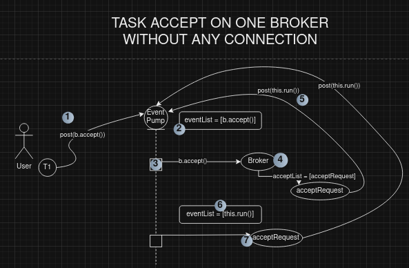
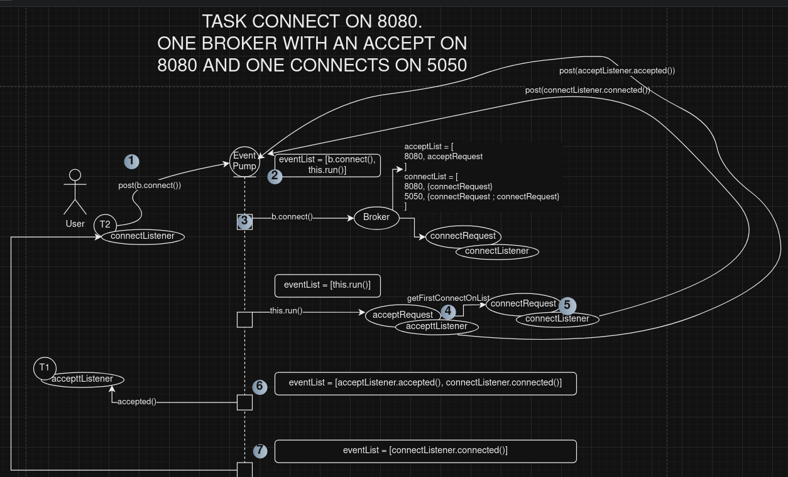
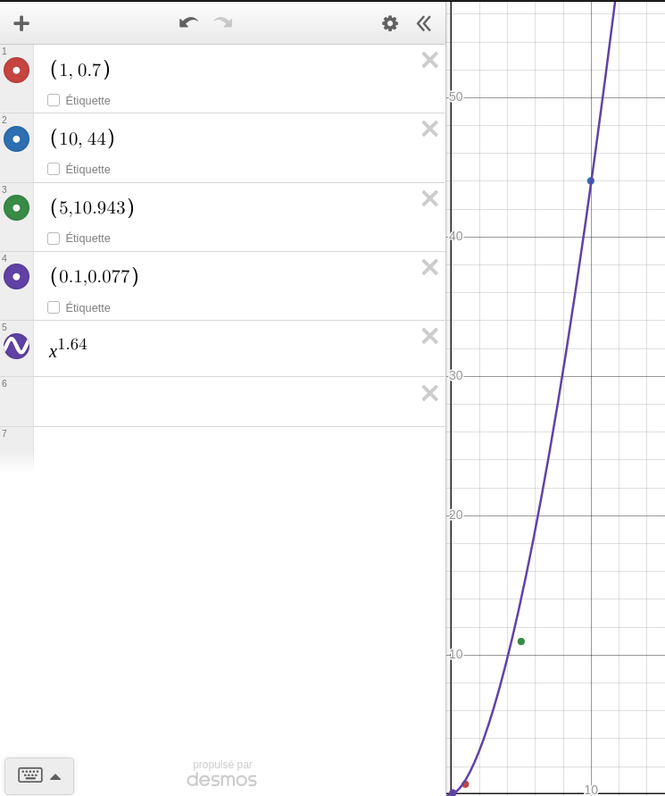

# Broker design

The broker is the main class of the broker and channel. It is the class that will handle the connections and the events.

## Accept events

The broker will create an acceptRequest object. This object will contain the port and the AcceptListener. The broker will then add this object to a list of acceptRequests. The acceptRequest will need to add itself to the EventPump as long as no connection is established. When a connection is established, the broker will remove the acceptRequest from the list and create the required channels. The broker will then add the channelEvent to the EventPump, as well as the connectEvent. These events will contain the channels created.

### Example of an accept sent to the broker (without any connect)



When a connect is dispatched, the broker will create a connectRequest object. This object will contain the port, the name and the ConnectListener. The broker will then add this object to a list of connectRequests. The connectRequest will NOT add itself to the EventPump as the idea is that the acceptRequest will catch that new connection.

### Example of a connect sent to the broker (with a previous accept on the same port and one connect on a random port)



### Chain connect/disconnect complexity 

I tested the broker with the following scenarios:

#### Scenario :

```
REPEAT {
- A accept is called on a port (the broker is listening)
- A connect is called on a port (creating the channels)
} UNTIL XXX times
```

This looks like an exponential growth.

These results are shown in the following graph:

