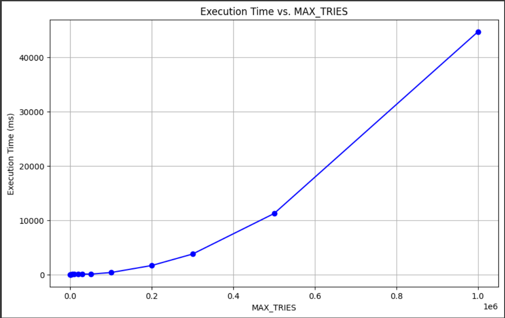

# Broker design

The broker is the main class of the broker and channel. It is the class that will handle the connections and the events.

## Accept events

The broker will create an acceptRequest object. This object will contain the port and the AcceptListener. The broker will then add this object to a list of acceptRequests. The acceptRequest will need to add itself to the EventPump as long as no connection is established. When a connection is established, the broker will remove the acceptRequest from the list and create the required channels. The broker will then add the channelEvent to the EventPump, as well as the connectEvent. These events will contain the channels created.

### Example of an accept sent to the broker (without any connect)


When a connect is dispatched, the broker will create a connectRequest object. This object will contain the port, the name and the ConnectListener. The broker will then add this object to a list of connectRequests. The connectRequest will NOT add itself to the EventPump as the idea is that the acceptRequest will catch that new connection.

### Example of a connect sent to the broker (with a previous accept on the same port and one connect on a random port)


### Chain connect/disconnect complexity 

I tested the broker with the following scenarios:

#### Scenario 1:

```
- A accept is called on a port (the broker is listening)
REPEAT {
- A connect is called on a port (creating the channels)
- A disconnect is called on the same port (the broker is listening again)
} UNTIL 10000 times
```

#### Scenario 2:

```
- A accept is called on a port (the broker is listening)
REPEAT {
- A connect is called on a port (creating the channels)
- A disconnect is called on the same port (the broker is listening again)
} UNTIL 100000 times
```

#### Scenario 3:

```
- A accept is called on a port (the broker is listening)
REPEAT {
- A connect is called on a port (creating the channels)
- A disconnect is called on the same port (the broker is listening again)
} UNTIL 500000 times
```

#### Scenario 4 (FINAL):

```
- A accept is called on a port (the broker is listening)
REPEAT {
- A connect is called on a port (creating the channels)
- A disconnect is called on the same port (the broker is listening again)
} UNTIL 1M times
```

The broker handled all scenarios successfully, giving this these execution times:

- Scenario 1: 0.077 seconds
- Scenario 2: 0.7 seconds (10x load , 10x time)
- Scenario 3: 10.943 seconds (5x load, ~15x time)
- Scenario 4: 44 seconds (2x load, ~4x time)

This looks like an exponential growth.

These results are shown in the following graph:

