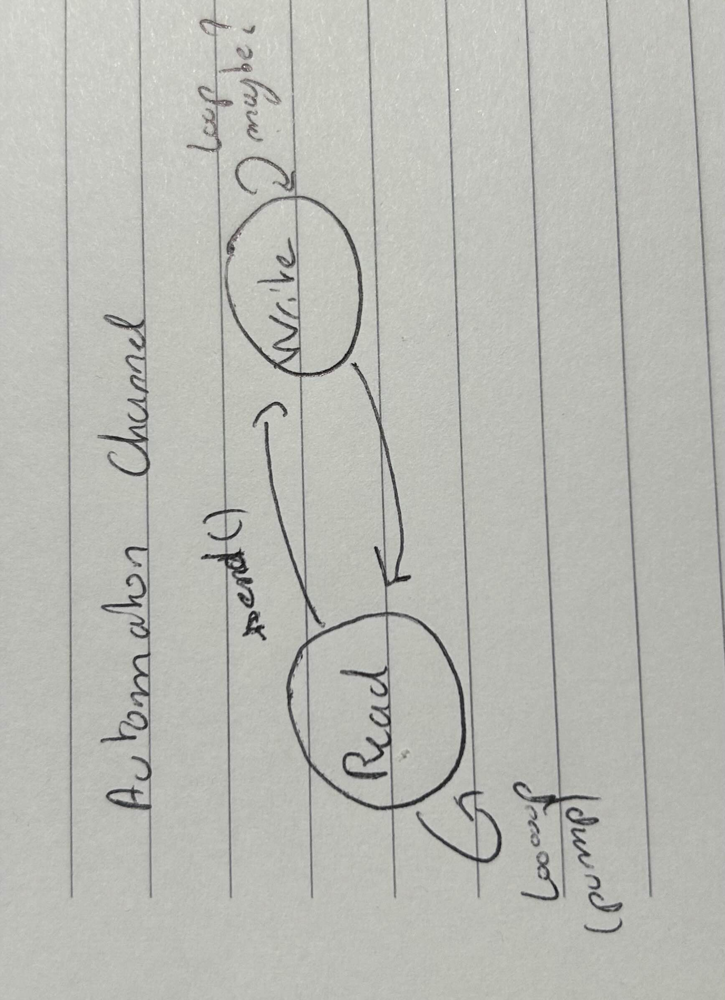

# Aim

The aim of this **full event** version of the broker and channel is to remove any threads. Will only remain one event pump and one thread that handles everything. The next step is to interface it with the task2 MessageQueue system. *This implies that every action is non blocking.*

The task3 and task4 implementations will offer the user a choice in terms of paradigm.

## The new Broker

*Note : Same interface as the old broker, different implementation.*

```java
package abstracts.full_event;

public abstract class BrokerAbstract {
	//Broker(String name) {};
	abstract ChannelAbstract accept(int port);
	abstract ChannelAbstract connect(String name, int port);
}
```

Image of the automaton : 

The main challenge is to handle the "*rendez-vous*" eventfully without blocking.

The specification with the accept method is the same as before, the programm should verify that the accept can be made
then return a Channel when the connection is done.

Same with the connect.

## The new Channel

*Note : Same interface as the old broker, different implementation.*

```java
package abstracts.full_event;

public abstract class ChannelAbstract {
	abstract int read(byte[] bytes, int offset, int length);
	abstract int write(byte[] bytes, int offset, int length);
	abstract void disconnect();
	abstract boolean disconnected();
}
```

Image of the automaton : 

Here the read and write should return the bytes read, including 0 as this should not block. The decision to read more bytes is left to the caller, here we just read and return.

The disconnect option is the same as before, it should close the channel and generate an event.
