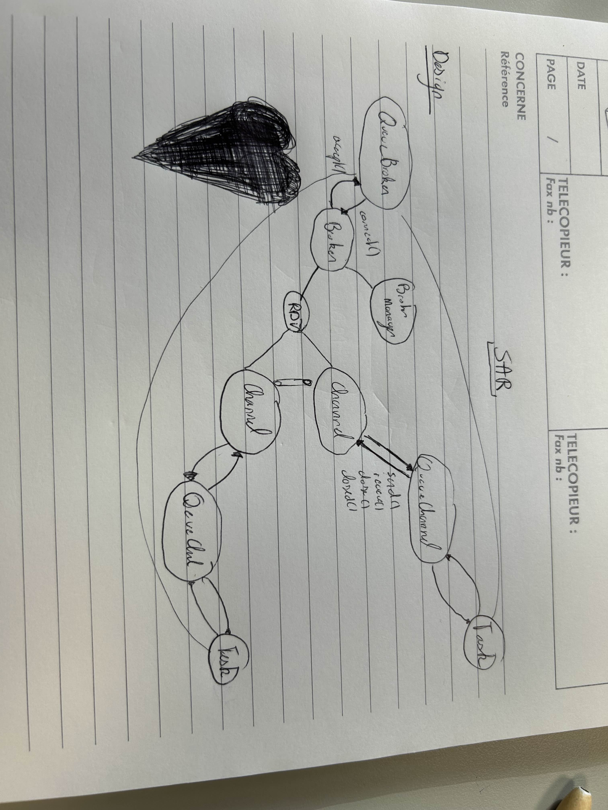

# Specification 

## Queue Broker

Nothing new here, it's just a normal broker that returns MessageQueue instead of Channels.

## Message Queue

The messaging system is changing. Instead of using Channels, we will use MessageQueues. A MessageQueue is a queue of messages. Each message is a byte array. The MessageQueue is a FIFO queue. The broker will return a MessageQueue instead of a Channel. The MessageQueue will have the following methods:

**The Messaging system is based on Channels.**

Sends a message (not a flux anymore) its sending a whole package.   

```java
void send(byte[] bytes, int offset, int length);
byte[] receive();
void close();
boolean closed();
```

- **send(byte[] bytes, int offset, int length)**
    - This method sends a message to the queue. The message is a byte array. The offset is the index of the first byte to send, and the length is the number of bytes to send. The method is blocking. It will wait until there is enough space in the queue to send the full message. The size of the message is limited by the size of `int`, for example, the maximum size of a message is `Integer.MAX_VALUE`. Any longer message will need to be split into multiple messages.
- **byte[] receive()** 
    - This method receives a message from the queue. The method is blocking. It will wait until there is a message in the queue to receive and then reads it fully.
- **close()**
    - This method closes the queue. After closing, no more messages can be sent or received.
- **boolean closed()**
    - This method returns true if the queue is closed, false otherwise.

## Task

The Task class is a wrapper around a Runnable. The Task class has the following methods:

```java
Task(Broker b, Runnable r);
Task(QueueBroker b, Runnable r);
Broker getBroker();
QueueBroker getQueueBroker();
static Task getTask();
```

- **Task(Broker b, Runnable r)**
    - This constructor creates a Task, associates it with the given Broker, and sets the Runnable to run.
- **Task(QueueBroker b, Runnable r)**
    - This constructor creates a Task, associates it with the given QueueBroker, and sets the Runnable to run.
- **Broker getBroker()**
    - This method returns the Broker associated with the Task.
- **QueueBroker getQueueBroker()**
    - This method returns the QueueBroker associated with the Task.
- **static Task getTask()**
    - This method returns the Task associated with the current thread.


## Design

The design looks basically the same as the previous one, but with the added Queue elements on top of the existing ones.

## Image



